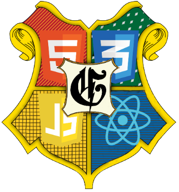
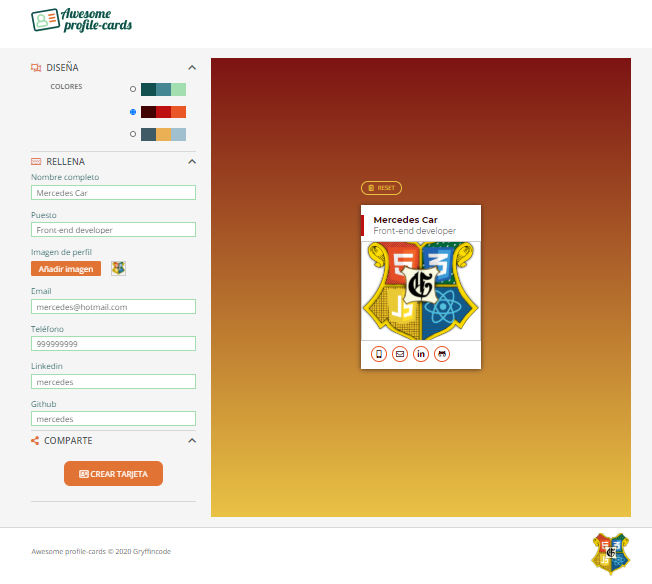
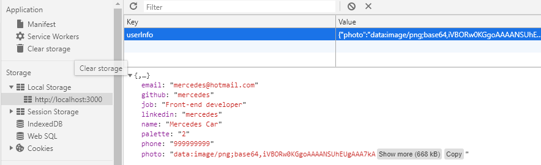
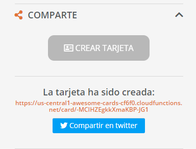
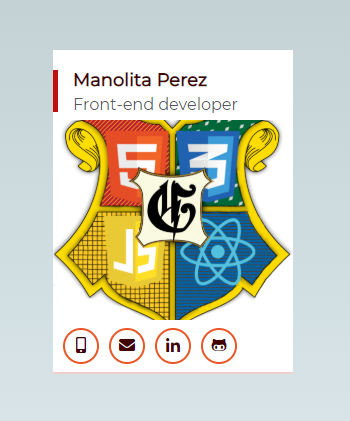

# Proyecto Grupal Módulo 2 de Adalab: Awsome profile cards

## Equipo Gryffincode

## Miembros

Alexandra López
Concha Asensio
María José Plaza
Mercedes Carballal

## En qué consiste

Se nos pide realizar una aplicación web que nos permita crear una tarjeta de visita personalizada.
En la página web podemos introducir nuestros datos profesionales y obtener una vista maquetada con esta información.

### Objetivos:

- Aprender los conceptos básicos de programación (variables, estructuras de datos, condicionales, funciones, etc.)
- Comprender cómo manipular el DOM de una página y responder a eventos del usuario
- Manejar estructuras de datos complejas, con arrays y objetos
- Realizar peticiones al servidor y almacenar datos en local
- Implementar Scrum como marco de referencia para el desarrollo del producto, basándonos siempre en los valores de Agile como puntos clave del trabajo en equipo y la mejora continua
- Mejorar la comunicación entre los miembros del equipo
- Mejorar vuestras habilidades de comunicación en público al exponer el proyecto en la sesión final

### Proyecto

El proyecto consta de 2 páginas:

- Una página landing de bienvenida
- Una página con la aplicación de crear tarjetas

La aplicación funciona siguiendo estos pasos:

- Permitir al usuario elegir el estilo de la tarjeta, eligiendo paleta de colores
- Permitir al usuario que, mediante la introducción de información en un formulario, este texto se muestre maquetado automáticamente en un cuadro similar a una tarjeta de visita, que será la muestra del resultado final
- Permitir que el usuario pueda crear una web con su tarjeta y compartirla por Twitter

La tarjeta de visita tiene los siguientes campos:

- Nombre completo
- Profesión
- Datos personales
  - Teléfono
  - Correo electrónico
- RRSS
  - LinkedIn
  - GitHub

Respecto a la interacción con la web:

- Los campos tienen restricciones para su formato indicado. Campo de teléfono para el móvil, mail para el correo, etc.
- Las modificaciones que hacemos en el formulario (diseño y contenido), aparecen automáticamente en la vista previa de la tarjeta
- Las 3 partes del proceso de creación son elementos colapsables, que al hacer clic en el título se muestra/oculta mostrando sólo una sección a la vez
- Toda la información del formulario se almacena en LocalStorage (almacenamiento local del navegador), de forma que al recargar la página sigue disponible y podemos borrarla con un botón de Reset. Para esto, definimos una estructura de datos compleja (con arrays y objetos) que es lo que guardamos en el navegador.

  

- Para compartir en Twitter seguiremos 2 pasos:

  1. Al hacer clic en el botón de "Enviar" enviamos el formulario (submit) a un API que devolverá la URL de una web con la tarjeta de visita con la información rellena

     

  2. Mostraremos esta URL para que el usuario verifique si la tarjeta está bien definida y un botón de "Compartir" que enlazará a Twitter donde habrá un tweet con texto predefinido que incluye la URL de la tarjeta

     

### Tecnologías empleadas

Gulp, JavaScript, SASS, Git (control de versiones, ramas)

